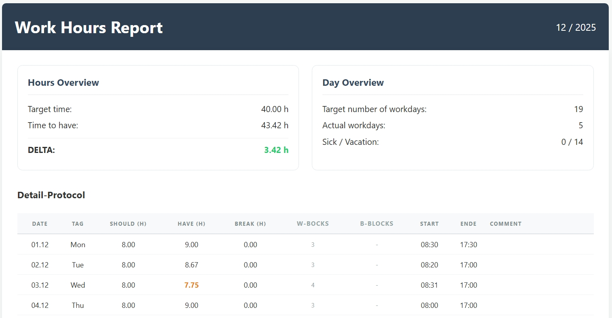

<p align="center">
  
</p>

# ⏱️ PlainTrack

**PlainTrack** is a minimalist, local-first work hours logger and report generator. It transforms simple, versionable text files into professional, high-fidelity HTML reports.

Built for developers and power users who prefer the command line and plain text over bloated web interfaces.

<p align="center">
  
</p>

---

## ✨ Core Philosophy

* **Local First:** Your data never leaves your machine. No cloud, no accounts, no tracking.
* **Plain Text Power:** Log your hours in simple `.txt` files. Fast, future-proof, and easy to edit.
* **Git-Ready:** Since every log and config is a flat file, your entire history is perfectly versionable via Git.
* **Data-Scoped Configuration:** Configuration lives next to the working-time data it belongs to. This keeps rules, holidays, closing days, vacation entitlements, and work models tied to the exact data set being reported.
* **Flexible Reporting Scopes:** By choosing a different root folder, you can define different configuration scopes. For example per year, project, client, employment contract, country, or organization.
* **Regulatory Flexibility:** Fully customizable rules for holidays, closing days, and individual work models.
* **Visual Insights:** Generates clean HTML reports featuring color-coded overtime analysis, work-block statistics, and break tracking.


---

## 🚀 Quick Start

1. **Create the structure:**
   `months/03/22.txt` (for March 22)
2. **Record the time:**
   Simply write `08:00 - 12:00` in the file.
3. **Generate report:**

   ```bash
   python plaintrack.py --path ./mydata --year 2026 --month 03
   ```

   `--path` points to the dataset root containing `config/` and `months/`.
   `--year` is used for calendar calculation and report labeling.
   `--month` selects the month folder to process.

---

## 📁 Data Structure

PlainTrack operates with work logs in a file-based yearly structure. Each year has its own `config/` next to its `months/` directory, allowing different working-time rules, vacation entitlements, holidays, company closing days, or contractual settings per year.

```text
my-work-logs-root/
├── config/                        # Configuration folder
└── months/
    └── 03/                        # Month folder
        ├── 01.txt                 # One file per day
```

This means that when generating a report for a specific year, the report generator reads the configuration from that year’s folder:

```bash
python plaintrack.py --path ./workslips/2025/ --year 2025 --month 03
```

In this example, the configuration is loaded from:

```text
./workslips/2025/config/
```

and the monthly work logs are loaded from:

```text
./workslips/2025/months/03/
```

---

## 🧭 Path vs. Calendar Year

PlainTrack separates the **data location** from the **calendar context**.

```bash
python plaintrack.py --path ./workslips/2025/ --year 2025 --month 03
```

At first glance, this may look redundant because the path already contains `2025`. However, these values have different responsibilities:

| Parameter | Purpose                                                                                                             |
| :-------- | :------------------------------------------------------------------------------------------------------------------ |
| `--path`  | Points to the root folder of the dataset that should be reported. This folder must contain `config/` and `months/`. |
| `--year`  | Defines the calendar year used for internal date calculation.                                                       |
| `--month` | Selects the month folder inside `months/`, for example `03` to process a report for.                                                        |

The `--year` parameter is required because PlainTrack needs a real calendar year to calculate:

* how many days the selected month has,
* which weekdays each date falls on,
* which days are regular working days,
* which days are weekends, holidays, closing days, vacation days, or work days,
* and how the final report should be named and labeled.

The `--path` parameter is not used to infer the year. It only tells PlainTrack where the data lives.

This is intentional. It allows flexible data scopes such as:

```text
workslips/
├── 2025/
├── 2026/
├── client-acme/
├── fulltime-contract/
└── parttime-contract/
```

A year-based folder structure is recommended for normal usage:

```text
workslips/
└── 2025/
    ├── config/
    └── months/
        └── 03/
```

But the folder name itself is not interpreted by plaintrack. When using year-based folders, keep the folder name and the `--year` value aligned:

```bash
python plaintrack.py --path ./workslips/2025/ --year 2025 --month 03
```

---

# Guides

* [Detailed Configuration Guide here](docs/Configuration.md)
* [Detailed Time Logging Guide here](docs/TimeLogging.md)
* [Detailed Generator Guide here](docs/Generator.md)